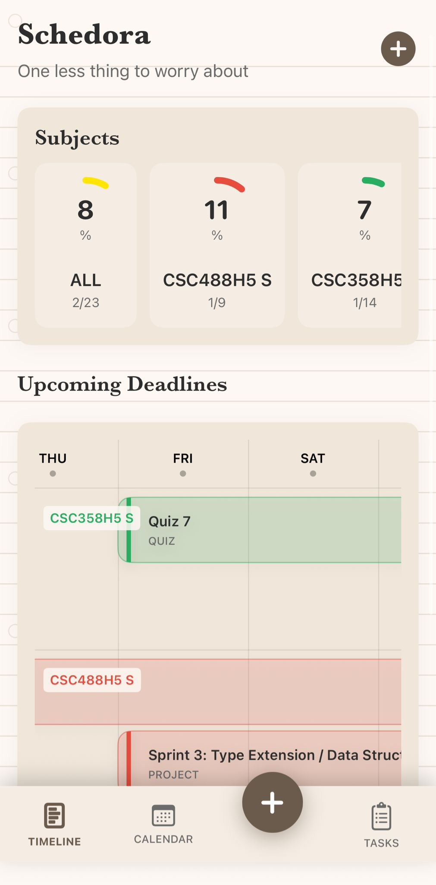
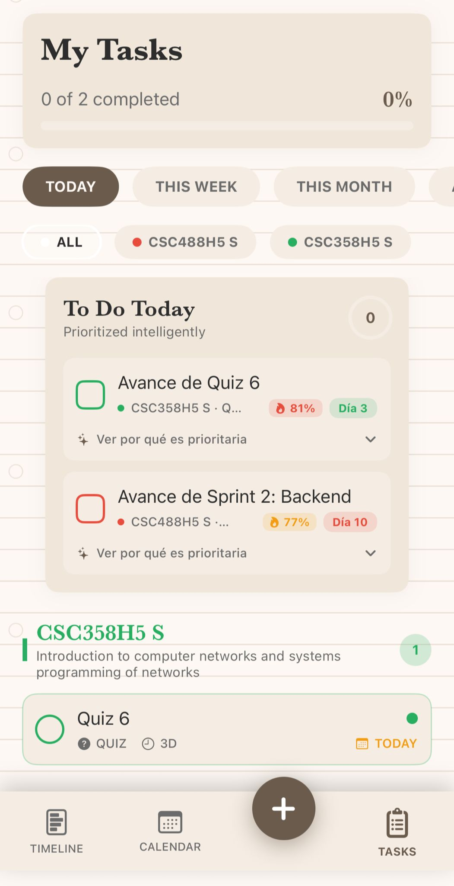
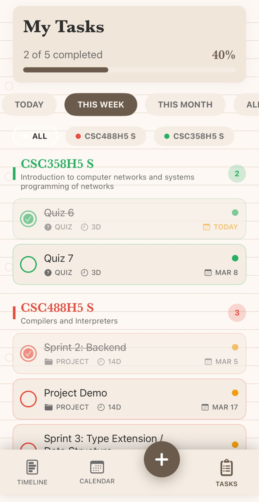
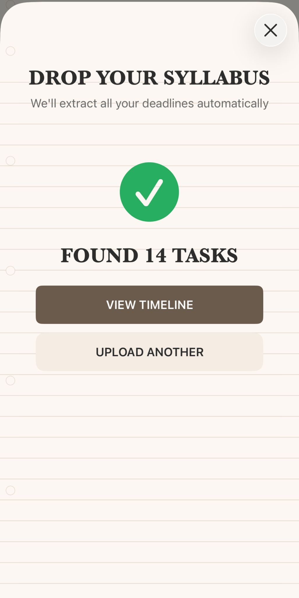

<div align="center">

# Schedora

**One less thing to worry about.**

An iOS app that turns your university syllabi into an organized, AI-prioritized task timeline — so you never miss a deadline again.

[Features](#-features) · [Screenshots](#-screenshots) · [Tech Stack](#-tech-stack) · [Project Structure](#-project-structure) · [Getting Started](#-getting-started)

</div>

---

## 🎯 What is Schedora?

Schedora is a student time management app built with SwiftUI. Drop a PDF syllabus and the app automatically extracts every deadline using AI, organizes them into an interactive Gantt-style timeline, and tells you exactly what to work on today.

No manual data entry. No overwhelming to-do lists. Just upload and go.

## ✨ Features

### 📄 AI-Powered Syllabus Parsing
- Upload any PDF syllabus and let **Google Gemini AI** extract all deadlines automatically
- Supports OCR fallback (via Apple Vision) for scanned documents
- Auto-creates subjects and tasks with correct types, due dates, and weights

### 📊 Smart Dashboard
- At-a-glance progress rings per subject showing completion percentage
- Upcoming deadlines view with a compact weekly calendar
- Subject cards with task counts and overall stats

### 📋 Task Management
- **Temporal filters:** Today, This Week, This Month, All
- **Subject filters:** View tasks per course or all at once
- Tasks grouped by subject with inline completion toggles
- Priority system: 🔴 Critical (exams/finals) · 🟡 Important (projects/assignments) · 🟢 Chill (quizzes/homework)

### 🤖 To Do Today — AI Mini-Missions
- AI selects the top prioritized tasks for today based on urgency, type importance, and due dates
- Shows a daily "To Do Today" section with actionable items and priority scores
- Expandable reasoning explaining *why* each task is prioritized
- Falls back to local prioritization if the API is unavailable

### 📅 Interactive Timeline (Gantt-style)
- Horizontal scrollable timeline with one column per day
- Tasks displayed as duration blocks grouped by subject
- Draggable edges to adjust start and due dates
- Today marker, semester end indicator, and smart subject ordering

### 📝 Task Details & Mini-Tasks
- AI-generated subtask breakdown per assignment type (e.g., 10 steps for an exam, 3 for a quiz)
- Progress tracking with checkboxes and visual progress bar
- Duration picker with inclusive day counting

### 🗓️ Calendar View
- Monthly calendar with task indicators on due dates
- Quick navigation between months

## 📱 Screenshots

<div align="center">
<table>
  <tr>
    <td align="center"><b>Dashboard</b></td>
    <td align="center"><b>Task List</b></td>
    <td align="center"><b>Weekly View</b></td>
    <td align="center"><b>PDF Upload</b></td>
  </tr>
  <tr>
    <td></td>
    <td></td>
    <td></td>
    <td></td>
  </tr>
</table>
</div>

## 🔧 Tech Stack

| Layer | Technology |
|-------|-----------|
| **Platform** | iOS 17.0+ |
| **Language** | Swift |
| **UI Framework** | SwiftUI |
| **AI Service** | Google Gemini API (`gemini-2.5-flash`) |
| **PDF Extraction** | PDFKit + Apple Vision (OCR fallback) |
| **Architecture** | MVVM with ObservableObject managers |
| **Dependencies** | Zero third-party libraries |

## 📁 Project Structure

```
Schedora/
├── Schedora.xcodeproj/                # Xcode project (open this)
└── Schedora/
    ├── SchedoraApp.swift              # App entry point
    ├── ContentView.swift              # Root view
    ├── DesignSystem.swift             # Colors, fonts, spacing tokens
    │
    ├── Models/
    │   ├── Task.swift                 # Task model (title, type, priority, dates)
    │   ├── Subject.swift              # Subject model (name, code, color)
    │   └── MockData.swift             # Sample data for development
    │
    ├── Components/
    │   ├── PriorityBadge.swift        # Priority indicator (Critical/Important/Chill)
    │   ├── ProgressRing.swift         # Circular progress ring
    │   ├── SubjectProgressCard.swift  # Subject card with stats
    │   └── TaskCard.swift             # Task card component
    │
    ├── Views/
    │   ├── MainTabView.swift          # Bottom tab bar (Timeline / + / Tasks)
    │   ├── DashboardView.swift        # Main dashboard with subjects & deadlines
    │   ├── TimelineView.swift         # Gantt-style horizontal timeline
    │   ├── TaskListView.swift         # Vertical task list with filters
    │   ├── TaskDetailView.swift       # Task detail with mini-missions
    │   ├── CalendarView.swift         # Monthly calendar view
    │   ├── AddTaskView.swift          # Manual task creation
    │   ├── EditSubjectView.swift      # Subject editing
    │   └── UploadPDFView.swift        # PDF upload + AI parsing flow
    │
    ├── Services/
    │   ├── GeminiService.swift        # Google Gemini API integration
    │   ├── ClaudeService.swift        # Anthropic Claude API (shared models)
    │   ├── PDFProcessingService.swift # PDF text extraction + OCR
    │   ├── TaskManager.swift          # Centralized task state management
    │   ├── SubjectManager.swift       # Subject CRUD + statistics
    │   └── MiniTaskManager.swift      # Daily mini-task AI generation
    │
    └── Assets.xcassets/               # App icons, colors, images
```

## 🚀 Getting Started

### Prerequisites
- **Xcode 16+**
- **iOS 17.0+** target device or simulator
- A **Google Gemini API key** ([get one here](https://aistudio.google.com/apikey))

### Setup
1. Clone the repository:
   ```bash
   git clone https://github.com/francoxortiz1975/Schedora.git
   cd Schedora
   ```
2. Open `Schedora/Schedora.xcodeproj` in Xcode
3. Set your API keys as environment variables in the Xcode scheme:
   - **Product → Scheme → Edit Scheme → Run → Arguments → Environment Variables**
   - Add `GEMINI_API_KEY` with your Gemini key
   - Add `CLAUDE_API_KEY` with your Anthropic key (optional)
4. Build & Run (⌘R)
5. Tap **+** on the dashboard → select a PDF syllabus → tasks are created automatically

## 🎨 Design

Schedora uses a warm **notebook-style** aesthetic — cream paper backgrounds, lined textures, and earthy tones. The design system includes:

- **Priority Colors:** Red (Critical), Yellow (Important), Green (Chill)
- **Typography:** SF Pro system fonts with custom weight tokens
- **Brand Voice:** Direct, honest, clean

## 📄 License

This project is for educational purposes.

---

<div align="center">
<b>Built with SwiftUI & AI</b>
</div>
